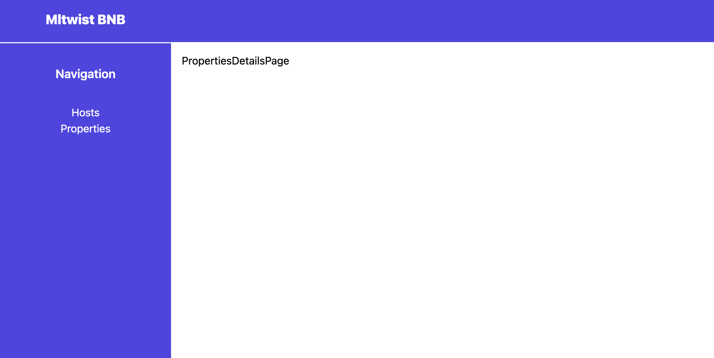

# Take Home Coding Challenge

## Description/Scenario

Mltwist has decided to pivot their business model and build a competitor to AirBnb and they need your help! The product is called Mltwist-Bnb. Mltwist-Bnb's competitive edge is that you can search by property or by host (a host is someone who manages a property). Mltwist-Bnb needs your help in implementing 4 pages on their site, a page to see all the properties (`PropertiesPage`), a page to see all the hosts (`HostsPage`), when clicking on a particular property - a page to see the property details (`PropertyDetailsPage`), and when clicking on a particular host - a page to see the host details (`HostDetailsPage`). To implement these pages will require your full stack skills of creating React pages, React pages calling REST APIs in the backend and creating backend API routes which access data from the database based on your schema design. You are in control and can implement the pages, design, schema, etc as you see fit.

### Requirements

- can click a navigation link in the sidebar to view all properties
- can click a navigation link in the sidebar to view all hosts
- can click on a particular property on the all properties page to go to the property details page
- can click on a particular host on the all hosts page to go to the hosts details page
- the property details page should list some basic info about the property along with some basic information about the hosts and links to view the hosts detail pages
- the host detail page should list some basic info about the host along with a list of their other properties, and clicking on any of their other properties should take you to that property's details page
- all data must come from the backend REST API and out of of the database
- a property can have more than 1 host and hosts can host more than 1 property
- fill out `./backend/seeds.js` so that running `npm run seed` will fill the database with a bunch of dummy records

### Bonus Points

- create a series of page routes `/admin/whatever` for creating new properties and hosts (not auth required to access the page)
- - Admin page that has a form to create a new host
- - Admin page that has a form to create a new property
- - Admin page that has a way to associate a host with a property

### Technical Notes/Getting Started

#### Frontend

- located at /frontend
- To setup, run `npm install`
- To start the frontend run `npm start` to run it on http://localhost:3000
- Project was scaffold with create-react-app and uses Tailwind for styling
- Pages and Routing have already been created at `App.jsx`
- Will need to run the backend app and make API calls to get data

#### Backend

- located at /backend
- To setup, run `npm install && npm run migrate`
- To seed the database, run `npm run seed`
- To start the backend run `npm start` to run it on http://localhost:3001
- Backend uses Prisma for the ORM and SQLite as a local database
- To create a database change/migration, modify the schema.prisma file and then run `npm run migrate` from the cli and enter the name of your migration and hit enter (see https://www.prisma.io/ for the Prisma documentation)
- After making database schema changes, modify your seeds.js file and run `npm run seed` to reseed the database with your new data in the new schema (FYI the seeds file just deletes everything in the two tables)
- FYI Backend was scaffold with express-generator
- Routes/Controller for hosts and properties have already been created at `./routes/hosts.js` and `./routes/properties.js` but they will need to be edited and/or additional routes added based on your needs
- You may need to add new tables and will need to add properties to existing tables. Add whatever fields to the database tables you think will be needed to model the relationships as well as what some dummy fields to make the app look interesting (ex: properties table, might be nice to have name, description, image_url (aka random internet photo link to an actual airbnb))
